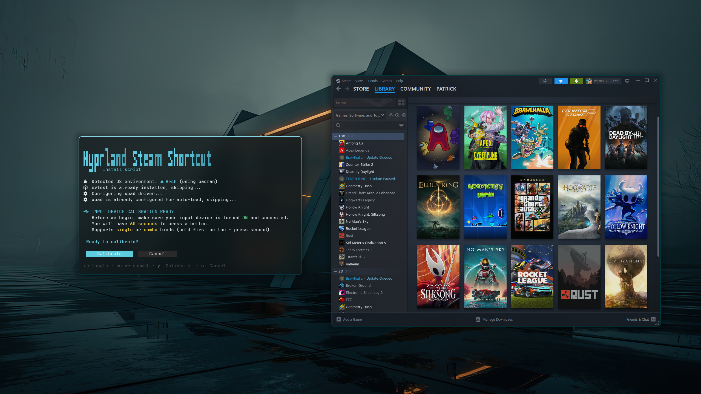

# Hyprland Steam Shortcut

Automated background service that maps any designated device input to launch Steam Big Picture Mode globally in a Hyprland/Wayland session.



---

## Requirements

<table border="0" cellpadding="0" cellspacing="0" rules="none">
  <tr>
    <td align="center"></td>
    <td><strong>systemd</strong> — for the background user service</td>
  </tr>
  <tr>
    <td align="center"></td>
    <td><strong>Arch Linux</strong> (pacman) or  <strong>Fedora</strong> (dnf)</td>
  </tr>
  <tr>
    <td align="center"></td>
    <td><strong>Hyprland</strong> — workspace focus and Steam window detection via <code>hyprctl</code></td>
  </tr>
  <tr>
    <td align="center"></td>
    <td><strong>Steam</strong> — installed on your system</td>
  </tr>
</table>

## Installation

You can install or update the shortcut trigger automatically using the following command.

### One-line Installer (Recommended)
Open your terminal and run (works on both Arch Linux and Fedora):

```bash
curl -sL https://raw.githubusercontent.com/Jeorge01/hyprland-steam-shortcut/main/install.sh | bash
```
You could also clone or download the install.sh file and run it like this

```bash
# Clone the repository
git clone https://github.com/Jeorge01/hyprland-steam-shortcut.git
cd hyprland-steam-shortcut

# Make the installer executable and run it
chmod +x install.sh
./install.sh
```
### Interactive Menu

When you run the installer, you'll see an interactive menu powered by [gum](https://github.com/charmbracelet/gum):

- **Bind device** — Calibrate and install the button trigger
- **Unbind** — Remove the installation completely (service, sudoers, scripts, logs)

`gum` is automatically installed if missing.

For a step-by-step manual installation, see [MANUAL.md](MANUAL.md).

## License
This project is licensed under the [MIT License](LICENSE).
